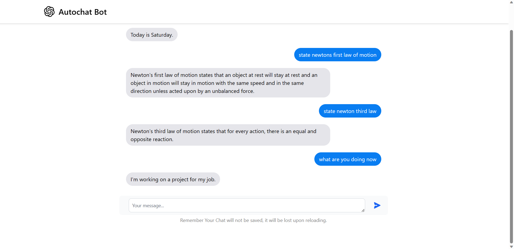

## Chat Bot with OpenAI API and Flask

Introducing the Flask Chat Bot powered by the OpenAI API! This innovative chat bot combines the flexibility and ease of use of Flask with the power of the OpenAI API to deliver intelligent and interactive conversations. With natural language processing capabilities, the chat bot can understand user queries and provide relevant responses in real time. Whether it's customer support, information retrieval, or just casual conversation, our chat bot is ready to engage and assist users with its advanced AI capabilities. Get ready for an immersive and dynamic chat experience like never before!

Live : http://paramveersapp.pythonanywhere.com/



## Prerequisites

- Python 3.9 or higher
- Flask
- OpenAI API
- OpenAI Python library

## Getting Started

1. Clone the repository:

   ```bash
   git clone https://github.com/paramsgit/autochat-bot

2  Navigate to the project directory:
    
    cd autochat-bot

3 Install the required dependencies using pip:
    
    pip install -r requirements.txt

4 Set up OpenAI API:

- Create an OpenAI account and obtain an API key.
- Set the OPENAI_API_KEY environment variable with your API key in main.py 

    API = "YOUR_API_KEY"

5 Run the application:

    python app.py

6 Open your web browser and visit http://127.0.0.1:{port}/ to access the chat bot.


## Usage
Once the application is running, you can interact with the chat bot through the web interface. Type your messages in the input box, and the bot will respond accordingly.

## Deployment
To deploy the chat bot to a production environment, follow the deployment instructions provided by the Flask documentation. It's recommended to use a production-ready WSGI server, such as Gunicorn or uWSGI.


## Contributing
Contributions are welcome! If you find any issues or have suggestions for improvements, please create a GitHub issue or submit a pull request.

    Feel free to modify and expand upon this template according to your specific project needs.


